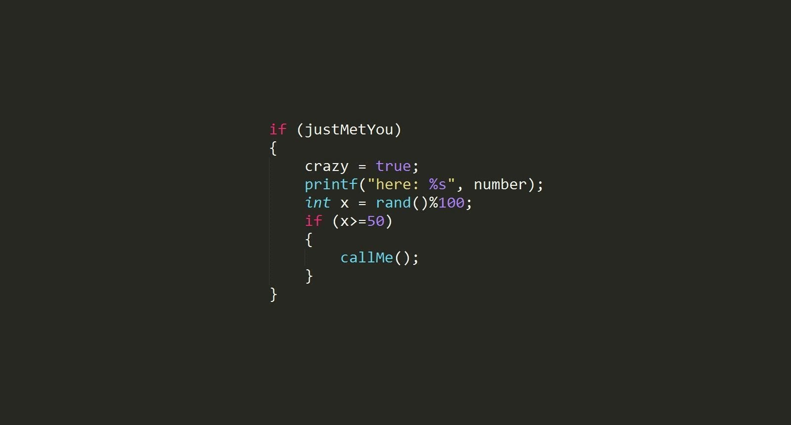

# Hello World! 👋

  

  <picture>
    <source
      srcset="https://lentidas-now-playing.vercel.app/api?scan=true&theme=dark"
      media="(prefers-color-scheme: dark)"
    />
    <source
      srcset="https://lentidas-now-playing.vercel.app/api?scan=true"
      media="(prefers-color-scheme: light), (prefers-color-scheme: no-preference)"
    />
    

  <picture>
    <source
      srcset="https://github-readme-stats.vercel.app/api?username=lentidas&show_icons=true&theme=dracula"
      media="(prefers-color-scheme: dark)"
    />
    <source
      srcset="https://github-readme-stats.vercel.app/api?username=lentidas&show_icons=true"
      media="(prefers-color-scheme: light), (prefers-color-scheme: no-preference)"
    />
    
  </picture>

  <picture>
    <source
      srcset="https://github-profile-trophy.vercel.app/?username=lentidas&theme=dracula"
      media="(prefers-color-scheme: dark)"
    />
    <source
      srcset="https://github-profile-trophy.vercel.app/?username=lentidas"
      media="(prefers-color-scheme: light), (prefers-color-scheme: no-preference)"
    />
    
  </picture>

## 🧑‍💻 About Me

Welcome to my GitHub profile! My name is Gonçalo and I'm an informatics engineering student at [HEIG-VD](https://www.heig-vd.ch/), currently working as a part-time DevOps Engineer at [Camptocamp](https://www.camptocamp.com/).

I'm passionate about software development, cybersecurity, and open-source projects. I'm always looking for new challenges and opportunities to learn and grow.

<!--
**lentidas/lentidas** is a ✨ _special_ ✨ repository because its `README.md` (this file) appears on your GitHub profile.

Here are some ideas to get you started:

- 🔭 I’m currently working on ...
- 🌱 I’m currently learning ...
- 👯 I’m looking to collaborate on ...
- 🤔 I’m looking for help with ...
- 💬 Ask me about ...
- 📫 How to reach me: ...
- 😄 Pronouns: ...
- ⚡ Fun fact: ...
-->
